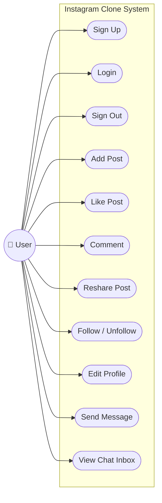
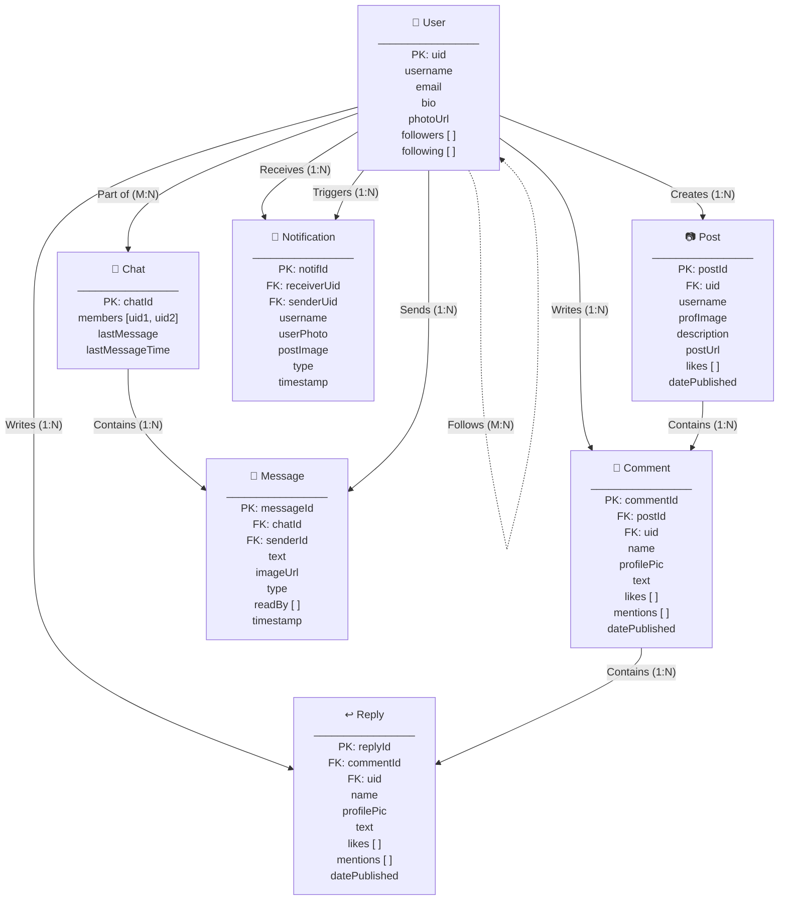

## 1. Use Case Diagram

```mermaid
graph LR
    %% Actor
    User((👤 User))

    %% System Boundary
    subgraph "Instagram Clone System"
        direction TB
        
        %% Auth
        SignUp([Sign Up])
        Login([Login])
        SignOut([Sign Out])
        
        %% Posts
        AddPost([Add Post])
        Like([Like Post])
        Comment([Comment])
        Reshare([Reshare Post])
        
        %% Profile & Chat
        Follow([Follow / Unfollow])
        EditProf([Edit Profile])
        Message([Send Message])
        chat([View Chat Inbox])
    end

    %% Relationships
    User --> SignUp
    User --> Login
    User --> SignOut
    User --> AddPost
    User --> Like
    User --> Comment
    User --> Reshare
    User --> Follow
    User --> EditProf
    User --> Message
    User --> chat
```

# ER Diagram

```mermaid
graph TD
    %% ==========================================
    %% Entities
    %% ==========================================
    
    User["👤 User<br/>_________________<br/>PK: uid<br/>username<br/>email<br/>bio<br/>photoUrl<br/>followers [ ]<br/>following [ ]"]

    Post["📷 Post<br/>_________________<br/>PK: postId<br/>FK: uid<br/>username<br/>profImage<br/>description<br/>postUrl<br/>likes [ ]<br/>datePublished"]

    Comment["💬 Comment<br/>_________________<br/>PK: commentId<br/>FK: postId<br/>FK: uid<br/>name<br/>profilePic<br/>text<br/>likes [ ]<br/>mentions [ ]<br/>datePublished"]

    Reply["↩️ Reply<br/>_________________<br/>PK: replyId<br/>FK: commentId<br/>FK: uid<br/>name<br/>profilePic<br/>text<br/>likes [ ]<br/>mentions [ ]<br/>datePublished"]

    Chat["📂 Chat<br/>_________________<br/>PK: chatId<br/>members [uid1, uid2]<br/>lastMessage<br/>lastMessageTime"]

    Message["📩 Message<br/>_________________<br/>PK: messageId<br/>FK: chatId<br/>FK: senderId<br/>text<br/>imageUrl<br/>type<br/>readBy [ ]<br/>timestamp"]

    Notif["🔔 Notification<br/>_________________<br/>PK: notifId<br/>FK: receiverUid<br/>FK: senderUid<br/>username<br/>userPhoto<br/>postImage<br/>type<br/>timestamp"]

    %% ==========================================
    %% Relationships
    %% ==========================================

    User -- "Creates (1:N)" --> Post
    User -- "Writes (1:N)" --> Comment
    User -- "Writes (1:N)" --> Reply
    
    User -- "Part of (M:N)" --> Chat
    Chat -- "Contains (1:N)" --> Message
    User -- "Sends (1:N)" --> Message
    
    User -- "Receives (1:N)" --> Notif
    User -- "Triggers (1:N)" --> Notif
    
    User -. "Follows (M:N)" .-> User
    
    Post -- "Contains (1:N)" --> Comment
    Comment -- "Contains (1:N)" --> Reply
```
